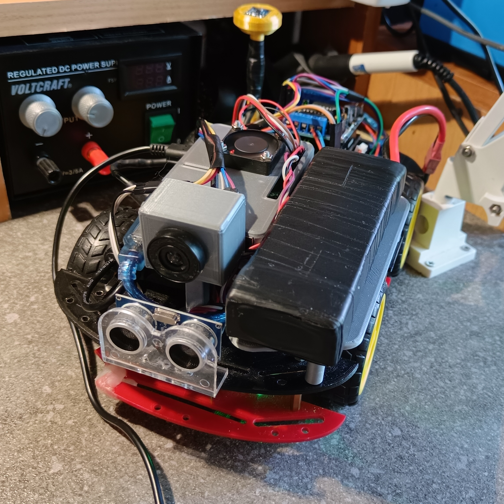

# Autonomous Mapping Car Project

## Overview

This project involves building an autonomous mapping car powered by Arduino and Raspberry Pi. The system uses various sensors and components to navigate and create a 2D map of the environment.

## Components

- Arduino
- Raspberry Pi
- Camera
- IR Encoders
- Ultrasonic Sensor
- DC Motors
- Arduino L293D shield
- Powerbank & battery
- Compass

## How it works

**Communication**

The communication between Arduino and Raspberry Pi is established via UART. The Raspberry Pi sends commands (e.g., FORWARD, LEFT) to the Arduino, which interprets and executes the corresponding movements. Additionally, the Arduino calculates PWM from the speed measured by IR encoders, sending distance traveled information to the Raspberry Pi every 100ms.

**Obstacle Detection And Sensors**

The project utilizes a camera for a simple edge-finding algorithm to detect obstacles and ground. An ultrasonic sensor, IR encoders on the motors, and a compass are also employed to gather data for navigation.

**Mapping Algorithm**

All the collected data is used to create a simple 2D map (top view) of the explored area. The map gradually expands as the car uses an algorithm to find the optimal path.

**Future Improvements**

- Implement advanced pathfinding algorithms for optimal navigation.
- Enhance obstacle detection algorithms for more complex environments.

